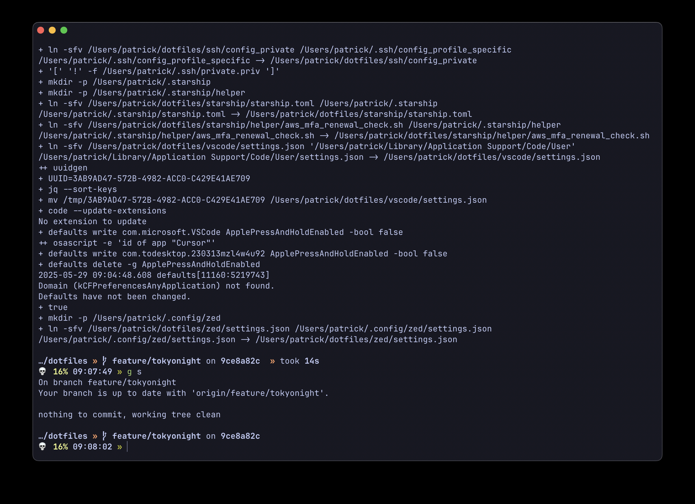
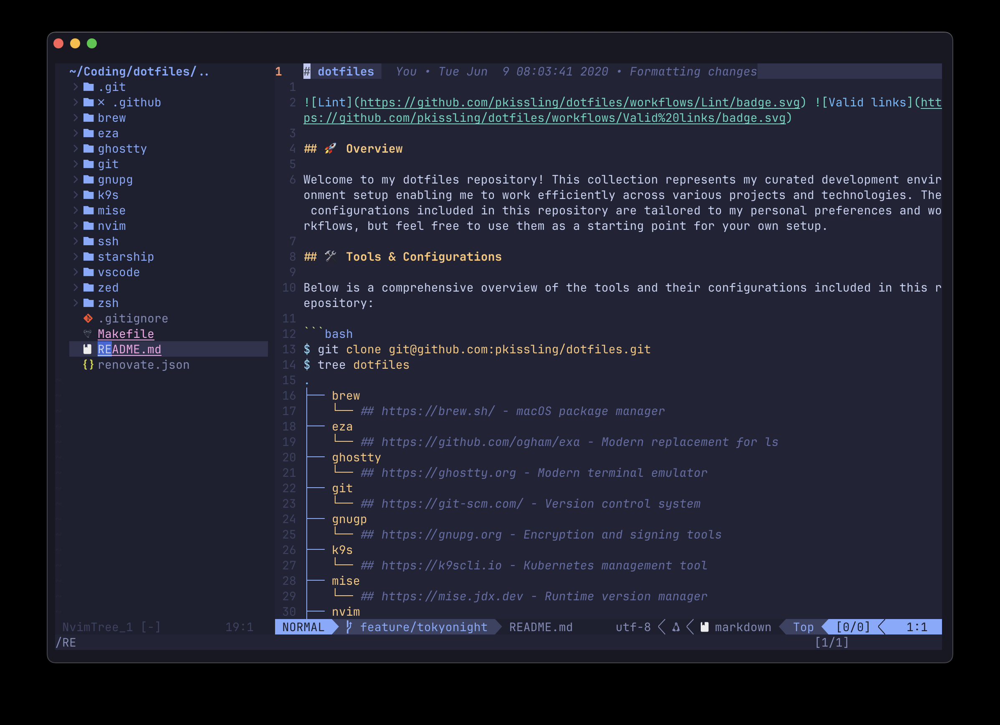

# dotfiles

 

## 🚀 Overview

Welcome to my dotfiles repository! This collection represents my curated development environment setup enabling me to work efficiently across various projects and technologies. The configurations included in this repository are tailored to my personal preferences and workflows, but feel free to use them as a starting point for your own setup.

## 🛠️ Tools & Configurations

Below is a comprehensive overview of the tools and their configurations included in this repository:

```bash
$ git clone git@github.com:pkissling/dotfiles.git
$ tree dotfiles
.
├── atuin
│   └── # https://atuin.sh - Powerful shell history manager
├── brew
│   └── # https://brew.sh/ - macOS package manager
├── codex
│   └── # https://openai.com/codex/ - AI-powered coding agent by OpenAI
├── claude
│   └── # https://claude.ai - AI-powered coding agent by Anthropic
├── eza
│   └── # https://github.com/ogham/exa - Modern replacement for ls
├── ghostty
│   └── # https://ghostty.org - Modern terminal emulator
├── git
│   └── # https://git-scm.com/ - Version control system
├── gnupg
│   └── # https://gnupg.org - Encryption and signing tools
├── k9s
│   └── # https://k9scli.io - Kubernetes management tool
├── mise
│   └── # https://mise.jdx.dev - Runtime version manager
├── nvim
│   └── # https://neovim.io - Modern Vim editor
├── ssh
│   └── # - Secure shell configuration
├── starship
│   └── # https://starship.rs - Minimal, fast shell prompt
├── vscode
│   └── # https://code.visualstudio.com - Code editor
├── zed
│   └── # https://zed.dev - Modern code editor
└── zsh
    └── # https://ohmyz.sh - Shell environment
```

Each tool in this collection comes with its own `install.sh` script, allowing for modular installation and configuration. This modular approach enables you to pick and choose which components you'd like to integrate into your environment.

## 🖼️ Visual Tour

### Terminal Environment

A terminal setup featuring Ghostty, zsh, and Starship prompt,



### Neovim Configuration



## 🚀 Quick Start

To install all configurations, simply run:

```bash
make
```

For individual tool installations, navigate to the respective directory and run its `install.sh` script.
